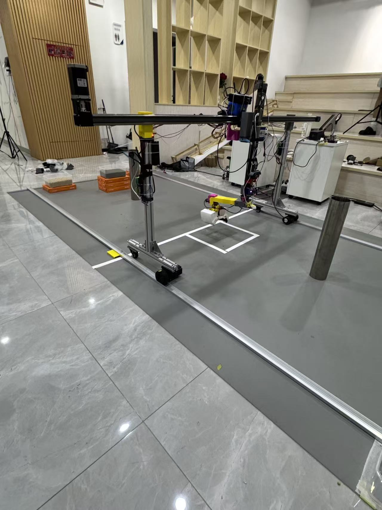
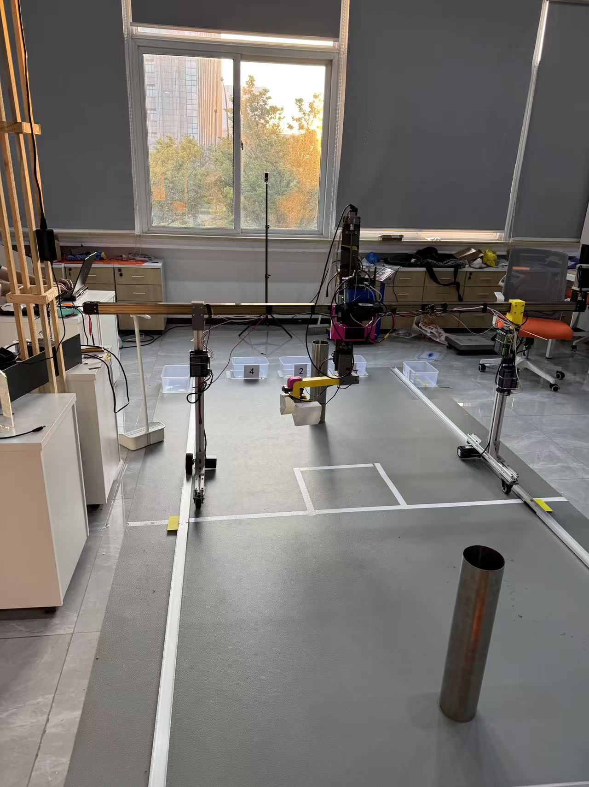
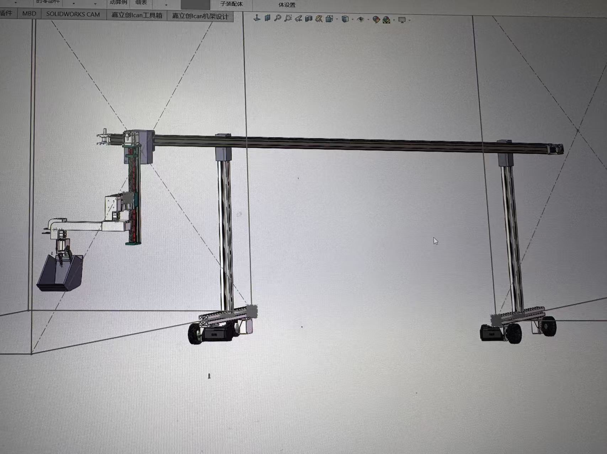
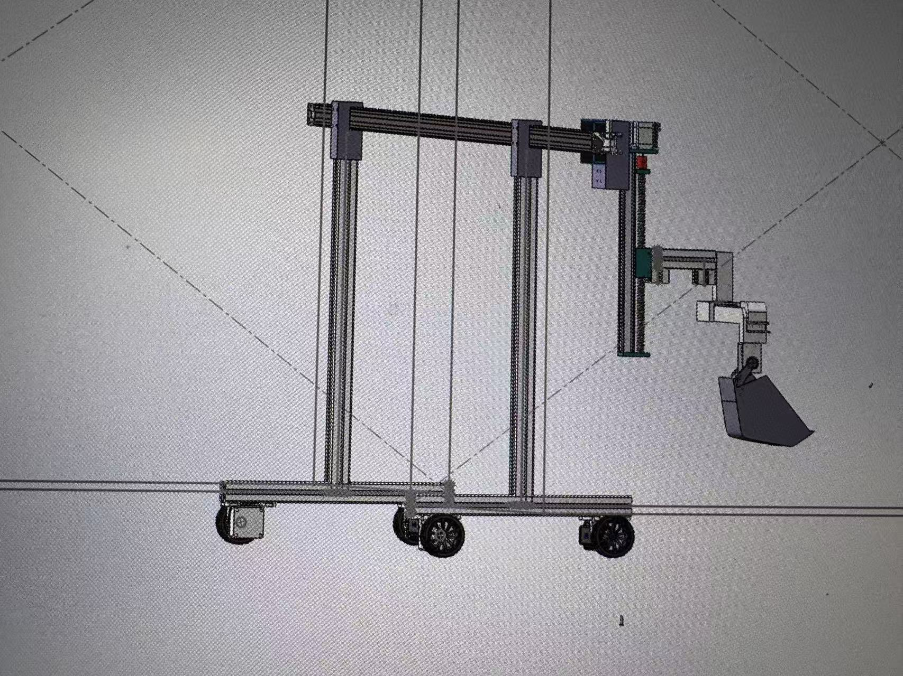

# 物流赛机器人模型

物流赛机器人机械模型与实物照片归档，包含 SolidWorks 整车装配体、配套零件以及 STEP / STL 格式模型。

从实物照片和模型视图可以看到，机器人采用龙门式框架，配有底部轮组、横梁移动机构、竖直升降机构和末端抓取机构。仓库供查看结构、学习装配和进一步修改模型使用。

## 实物展示

### 整体视角



实物在场地中的整体布置，可见两侧支撑、横梁、升降机构和末端夹持部件。

### 正面视角



从正面查看框架跨度、轮组布置及抓取机构与场地的相对位置。

## 模型展示

以下为 SolidWorks 模型屏幕照片，供对照机械结构。





## 结构与目录

| 目录或文件 | 内容 |
| --- | --- |
| `物流整车.SLDASM` | 整车主装配体，建议从此文件开始查看 |
| `x轴/`、`y轴/`、`Z轴/` | 各轴机构相关的零件与装配文件 |
| `车轮/` | 轮组、联轴器及相关模型 |
| `夹爪5/`、`抓斗/`、`抓斗主体不带齿/` | 末端抓取机构相关模型及附带资料 |
| `多功能支架/`、`舵机连接件/`、`加长件/` | 支架、连接件与延伸部件模型 |
| `docs/images/` | 实物照片与 SolidWorks 模型屏幕照片 |

根目录另有电机、摄像头装配体、支架及其他配套模型。上述目录说明依据现有文件组织，不代表已验证的装配层级。

`112-2.8N电机.stp` 统一保留在仓库根目录，`x轴/` 下内容完全相同的副本已去除。若打开旧模型时需要重新定位该 STEP 文件，请选择根目录中的同名文件。

## 打开模型

1. 下载整个仓库：在 GitHub 页面选择 **Code → Download ZIP** 并解压，或使用下面的克隆命令。
2. 保留原有文件名与目录结构，使用 SolidWorks 打开根目录的 `物流整车.SLDASM`。
3. 如果提示缺少引用文件，在已解压的仓库及对应子目录中查找零件或子装配体，再重新指定引用路径。

```bash
git clone https://github.com/kkppshuai-svg/logistics-robot-model.git
```

主装配体需要配套零件，建议完整下载仓库。STEP / STP 文件可用于在支持这些格式的 CAD 软件中查看几何结构；STL 文件用于网格查看，打印前需自行检查单位、尺寸与网格质量。

## 文件内容

- `.SLDASM`：整车及子装配体。
- `.SLDPRT`：SolidWorks 零件。
- `.STEP` / `.stp`：交换格式模型。
- `.STL`：网格模型。
- 原目录附带的图片和演示视频。

SolidWorks 临时锁文件（`~$` 开头）未纳入版本控制。

## 使用说明

本仓库归档原模型文件及展示照片。实物照片与模型视图用于结构参考，不保证所有细节或机构位置完全一致。

尚未验证全部装配引用能否在其他电脑上解析，也未确认所需的 SolidWorks 版本。仓库目前未提供控制程序、接线图、完整物料清单或运动性能验证数据。
